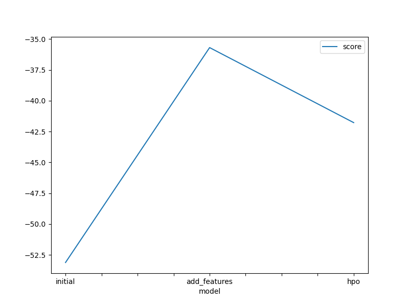
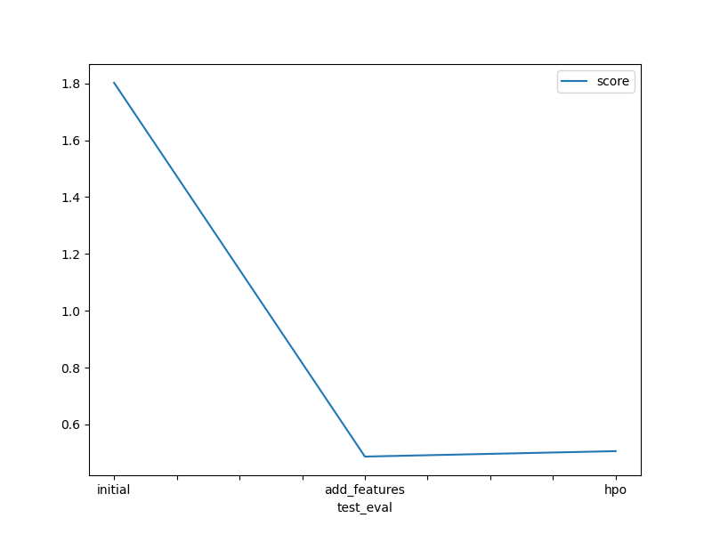

# Report: Predict Bike Sharing Demand with AutoGluon Solution
#### Mostafa Noaman Ahmed

## Initial Training
### What did you realize when you tried to submit your predictions? What changes were needed to the output of the predictor to submit your results?
- When submitting the predictions, it won't accept if I didn't set the negative values to zero as count can't be with negative.

### What was the top ranked model that performed?
- In my case, it was the second fitted model, which was called "predictor_new_features", that uses the data of the date column and split it to years, months, days and hours and removed the date column with the old format.

## Exploratory data analysis and feature creation
### What did the exploratory analysis find and how did you add additional features?
- It finds the outliers in the dataset using "hist()" pandas method, and in order to add more features I separated out the datetime into hour, day, or month parts.

### How much better did your model preform after adding additional features and why do you think that is?
- Its 'rmse' reduced from "1.80795" to "0.48988" and that's good. I think the reason behind this is that we make feature engineering for the date column and extracted features more representative for the model to handle.

## Hyper parameter tuning
### How much better did your model preform after trying different hyper parameters?
- Its 'rmse' increased from 0.48988 to 0.52191, so the model preformance regarded.

### If you were given more time with this dataset, where do you think you would spend more time?
- With data processing and EDA, as once I could passed EDA and processed the data in an organized meaningful manner, it'll be easy to fed it to ML model then.

### Create a table with the models you ran, the hyperparameters modified, and the kaggle score.
|model|hpo1|hpo2|hpo3|score|
|--|--|--|--|--|
|initial|default|default|default|1.80795|
|add_features|default|default|default|0.48986|
|hpo|{'n_estimators': Int: lower=100, upper=400, 'max_depth': Int: lower=4, upper=12, 'learning_rate': Real: lower=0.0001, upper=0.01}|{'iterations': 100, 'learning_rate': Real: lower=0.0001, upper=0.01, 'depth': Int: lower=6, upper=10}|{'num_boost_round': 100, 'num_leaves': Int: lower=26, upper=66}|0.50607|

### Create a line plot showing the top model score for the three (or more) training runs during the project.

### Create a line plot showing the top kaggle score for the three (or more) prediction submissions during the project.

## Summary
**AutoGluon** is a very powerful tool for saving programmer time by choosing the best model for the problem needn't to let programmer run many models sequentially and choose the best one manual, actually the best model is that is trained on the feature engineered dataset with the column 'date' being zipped to its years, months, days and hours. while the wrost model was the one trained on the normal dataset before feature engineering, the hyperparameter tuning is not preferred when using AutoGluon as it do it already as I mentioned at the beginning, so it was a waste of time compared to its performance.